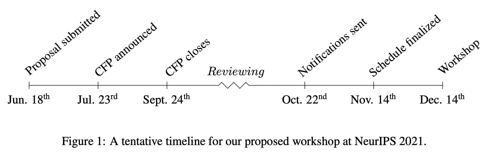

AIPLANS will solicit four-page paper submissions in a CFP to be circulated pending workshop acceptance. To encourage submissions from the broader ML/PL community, accepted authors will be given an opportunity to showcase their work in a virtual poster session or lightning talk for outstanding contributions. To minimize potential conflicts of interest, AIPLANS will manage submissions via the OpenReview conference management system.

Those who traditionally publish in venues such as SIGPLAN, SIGSOFT and other ACM venues are encouraged to submit work that may be considered relevant to the machine learning and reasoning community, provided that effort is taken to ensure its accessibility. Special consideration will be given to didactic submissions of outstanding clarity. Further information, including evaluation criteria, examples of relevant literature, deadlines and workshop logistics will be provided for reference.

If accepted, AIPLANS will announce its CFP and pursue contributions from the broader ML/PL community shortly thereafter. Two months later, the CFP will close on Sept. 24th. This deadline may be extended to no later than Oct. 1st, depending on the volume of submissions received, leaving sufficient time for referees and program chairs to leave feedback. Authors will be notified of acceptance no later than Oct. 22nd. We intend to finalize the schedule and coordinate presentation logistics between Nov. and Dec. 14th. Those who wish to prerecord talks will be given an opportunity to do so. The final workshop will consist of prerecorded and live talks with Q&A, followed by a moderated panel, and virtual poster session hosted on GatherTown. Further details about schedule and logistics will be made available, pending acceptance.