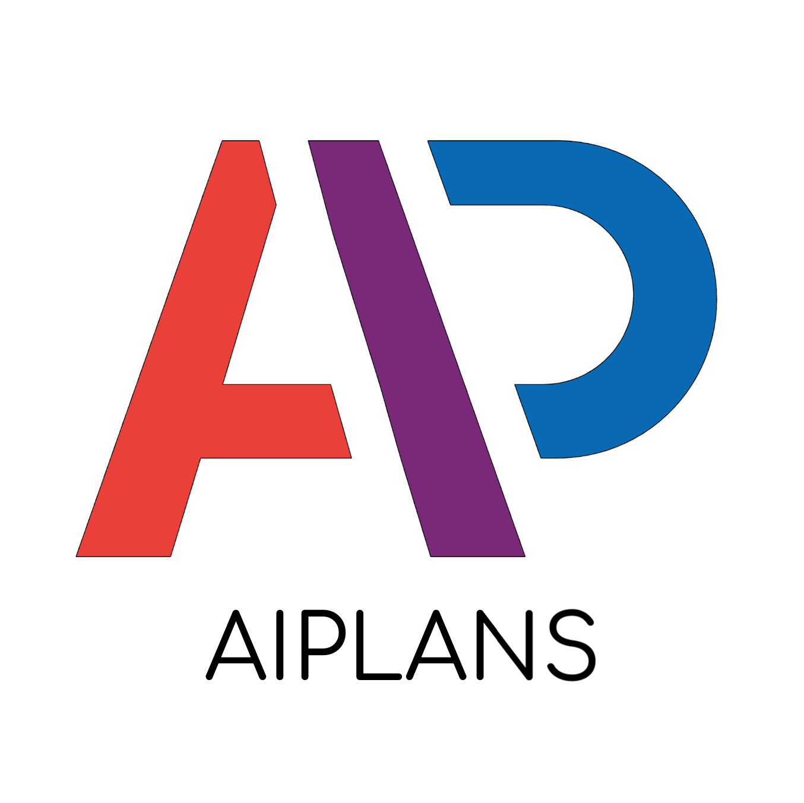

---
# Feel free to add content and custom Front Matter to this file.
# To modify the layout, see https://jekyllrb.com/docs/themes/#overriding-theme-defaults

permalink: /
title:
layout: home
---

> [New: Click here to watch the recordings!](https://slideslive.com/neurips-2021/workshop-advances-in-programming-languages-and-neurosymbolic-systems-aiplans)

  

AIPLANS (Advances in Programming Languages and Neurosymbolic Systems): a new workshop at NeurIPS 2021 fusing ML with programming theory to create neurosymbolic program-writing machines!

* **Paper submission deadline**: Oct. 4th, 2021 AoE
* **Reviews released**: Oct. 23rd, 2021
* **Camera-ready deadline**: Dec. 1st, 2021 AoE
* **Workshop date**: Dec. 14th, 2021

Our workshop brings together researchers from various backgrounds.  We believe developing neurosymbolic systems will require engineers, designers and theorists from statistical learning and programming language research.

* **Machine learning researchers** can present advances in meta-learning, reinforcement learning and program synthesis. AIPLANS offers these participants an opportunity to share their research and learn about new automatic programming languages and techniques for inference.
* **Programming language designers** can give insight into the design and implementation of automatic programming languages and DSLs. AIPLANS offers them the opportunity to gather feedback about design choices, promote the language and engage with their users.
* **Programming language theorists** can present fundamental theory of mechanical reasoning and automatic programming languages, such as functional, semiring or array programming. AIPLANS will help them bridge the gap between theory and practice, and gain insight into the capabilities and limitations of machine learning technology.

[comment]: <> (* **Probabilistic programming** researchers can present progress in a long history of extending programming paradigms &#40;e.g. functional or logic programming&#41; to handle learning under uncertainty. AIPLANS would provide them with new insights for extending these &#40;often symbolic&#41; languages with primitives for expressing neural models.)

[comment]: <> (Automatic differentiation libraries and frameworks have enabled much progress in gradient-based learning over the last decade. Recent domain-specific languages for automatic programming hold the promise of unleashing similar progress in other logical disciplines e.g., belief nets, proof nets, and related message passing schemes on tree- and graph-structured data. Concurrently, machines have made steady progress in representing and synthesizing programs. Other workshops have explored these themes separately, yet few have highlighted the synergies between automatic and synthetic programming.)

[comment]: <> (Not only does machine learning benefit from languages for programmable inference, these systems can also be seen as a kind of low-level programming languages in their own right, consisting of differentiable and stochastic primitives. Thanks to recent progress in statistical language modeling, these systems are increasingly capable of generating symbolic functions resembling procedures a human programmer might plausibly write in a high-level language.)

[comment]: <> (Applying techniques from programmable inference to transform and generate programs, and adapting insights gained developing those same programs to drive innovation in higher-order AD and probabilistic programming is a now virtuous cycle. We envision cooperation between automatic and synthetic programming will continue to grow as researchers become more accustomed to outsourcing low-level reasoning tasks to these systems.)

Specifically, AIPLANS seeks to encourage research and highlight recent advances among the following list of topics:

* Neural program synthesis (e.g., search-based, syntax or execution-guided)
  * [Neural Program Learning under Noisy I/O](https://arxiv.org/abs/1703.07469),
  * [Solving programming competition-style problems from I/O examples](https://arxiv.org/abs/1611.01989)
  * [Naturalizing A Programming Language Via Interactive Learning](https://arxiv.org/pdf/1704.06956.pdf)
* Bayesian program learning (e.g., higher-order probabilistic programming)
* Neural-symbolic reasoning (e.g., automated program verification and testing)
  * [Neural Programmer-Interpreters](https://arxiv.org/abs/1511.06279),
  * [Agents that execute declarative programs](https://arxiv.org/pdf/1706.06383.pdf)
* Neural program extraction (e.g., procedural or relational knowledge distillation)
* Induction of formal languages (e.g., grammar inference, automata extraction)
* Natural language programming (e.g., machine teaching, programming by example)
* New programming languages for reasoning (e.g., Prolog, Datalog, [miniKanren](http://minikanren.org/), [HOL](https://hol-theorem-prover.org/), [LF/Twelf](http://twelf.org/wiki/LF), [L∃∀N](https://leanprover.github.io/about/), et al.)
    * [Dynamical systems that sort lists](http://hrl.harvard.edu/publications/brockett88dynamical.pdf)
    * [Thinking Like Transformers](https://arxiv.org/abs/2106.06981)
* New programming languages for learning (e.g., [JAX](https://github.com/google/jax), [Dex](https://github.com/google-research/dex-lang), [HaskTorch](https://github.com/hasktorch/hasktorch), et al.)
* New programming languages for probability (e.g., [Stan](https://github.com/stan-dev/stan), [Edward](https://github.com/blei-lab/edward), [PyMC3](https://github.com/pymc-devs/pymc3), [Pyro](https://github.com/pyro-ppl/pyro), [torch-struct](https://arxiv.org/abs/2002.00876))
* Programing language theory (e.g., type theory, category theory, denotational semantics)
  * [Categorical Foundations of Gradient-Based Learning](https://arxiv.org/abs/2103.01931)
* Satisfiability checking and symbolic computation (e.g. SAT/SMT solving, boolean circuits)
  * [Bridging deep learning and logical reasoning](https://arxiv.org/pdf/1905.12149.pdf)
  * [Learning a SAT Solver from Single-Bit Supervision](https://arxiv.org/pdf/1802.03685.pdf)
* Calculus and equational reasoning (e.g., λ-calculus, π-calculus, tensor and combinator calculi)
  * [Differential linear logic](https://arxiv.org/pdf/1606.01642.pdf), [differential lambda calculus](https://core.ac.uk/download/pdf/82396223.pdf)
* Logic and relational programming (e.g., Prolog, Datalog, [miniKanren](http://minikanren.org/), [HOL](https://hol-theorem-prover.org/), [LF/Twelf](http://twelf.org/wiki/LF), [Lean](https://leanprover.github.io/about/), et al.)
* Inference algorithms (e.g., backpropagation, belief propagation, survey propagation et al.)
  * [Inside-Outside and Forward-Backward Algorithms](https://www.cs.jhu.edu/~jason/papers/eisner.spnlp16.pdf)
* Array programming (e.g. [TensorNetwork](https://github.com/google/TensorNetwork), [opt_einsum](https://github.com/dgasmith/opt_einsum), [Naperian Functors](https://www.cs.ox.ac.uk/people/jeremy.gibbons/publications/aplicative.pdf), [pointful](https://arxiv.org/pdf/2104.05372.pdf), et al.)
* Dynamic programming and reinforcement learning (e.g. [Semiring programming](https://arxiv.org/pdf/1609.06954.pdf), [probabilistic programming](https://arxiv.org/pdf/2005.09089v3.pdf))
    * [Deep Probabilistic Programming](https://arxiv.org/abs/1701.03757), [Stochastic Processes as Concurrent Constraint Programs](http://citeseerx.ist.psu.edu/viewdoc/download?doi=10.1.1.44.7979&rep=rep1&type=pdf)

Developers of languages, frameworks and libraries, including those who traditionally publish in venues such as SIGPLAN and SIGSOFT are encouraged to share ongoing work that would also be relevant to machine learning community.

AIPLANS is brought to you in collaboration with the organizers of the [Differentiable Programming Workshop](https://diffprogramming.mit.edu/) at NeurIPS 2021. We share their enthusiasm for differentiable and probabilistic programming and see many applications towards program synthesis and symbolic reasoning. Those with similar interests are highly encouraged to participate in both workshops, to be held on consecutive days (Dec. 13th and 14th, 2021).
